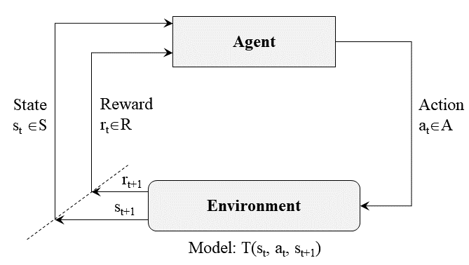
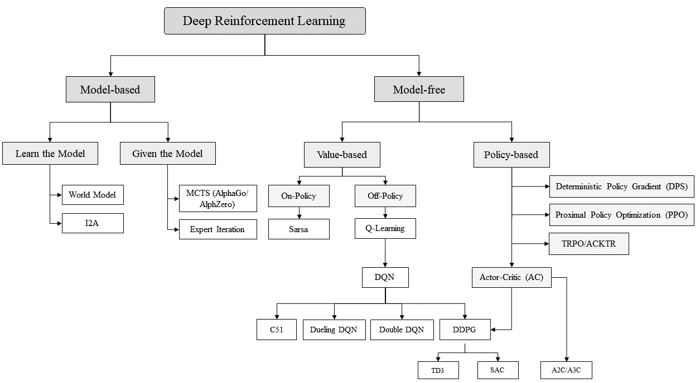

# Reinforcement Learning

Reinforcement Learning (RL) {cite}`sutton_bach_barto_2018` is a unique ML technique. It’s distinguishable from the other techniques for not requiring any training data nor examples, as it simply involves learning by experience. RL is not supervised and is not unsupervised. RL is weakly supervised or semi-supervised learning paradigm. RL is learning what to do –how to map situations to actions– so as to maximize a numerical reward signal. RL features an interactive intelligent agent with an explicit goal to achieve. As illustrated in the following figure, agent’s utility is defined by the reward function and the agent must (learn to) act so as to maximize expected rewards. 

Policy is the agent’s “plan of action” that is, how the agent reacts to different environment situations and how it translates the states to actions. Rewards are the numerical values given by the environment to the agent in response to a state-action pair. These rewards describe the immediate, intrinsic desirability of environmental states. Value Function is the long term version of a reward function, calculating discounted return starting from a specific state following a certain policy. The environment model is a representation of the environment behavior.

Deep reinforcement learning (deep RL) is a subfield of machine learning that combines reinforcement learning (RL) and deep learning. The following diagrams shows different types of deep RL algorithms {cite}`electronics10090999`.

The following projects are examples of RL application in solving combinatorial optimization problem related to smart mobility:
- Learning heuristics over large graph: Graph Convolutional Network is proposed to solve large instances of problems such as Minimum Vertex Cover (MVC) and Maximum Coverage Problem (MCP) {cite}`manchanda2020learning`. Example of a real-world applications of MVC and MCP include, but are not limited to [Optimal placement of traffic security cameras using MVC](https://github.com/Youlina3/Traffic-Camera-Installation-Based-on-Vertex-Cover-Optimization) and [Time-constrained maximal covering routing problem](https://github.com/Youlina3/Traffic-Camera-Installation-Based-on-Vertex-Cover-Optimization).
- Travelling Salesman Problem (TSP) {cite}`bello2017neural,dacosta2020learning`
- Vehicle Routing Problem (VRP) {cite}`nazari2018reinforcement` and Capacitated Vehicle Routing Problem (CVRP) {cite}`delarue2020reinforcement`
- [DeepPool](https://github.com/Aidandos/deeppool), a distributed model-free algorithm for ride-sharing using deep reinforcement learning {cite}`al-abbasi_ghosh_aggarwal_2019`
- [MOVI](https://github.com/hitsuji5/fleet-sim), a model-free approach for a large-scale taxi dispatch problem. To ensure scalability, a distributed DQN with streamlined training algorithm is used {cite}`oda2018movi`
- DeepFreight, a model-free learning framework for the freight delivery problem. It decomposes the problem into two closely-collaborative components: truck-dispatch and package-matching {cite}`chen2021deepfreight`

